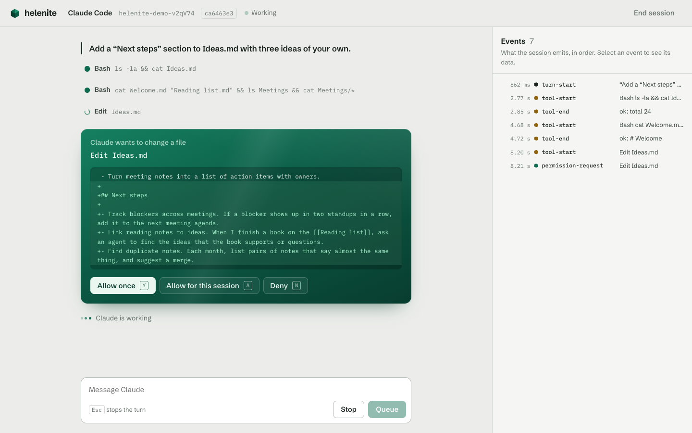

# agent-helenite

## About

Claude Code and Codex are strong coding agents, but you usually reach them through a terminal. agent-helenite lets a TypeScript app run an agent session directly. The app starts the harness, sends messages, streams the replies, and shows tool approvals in its own UI. No terminal is necessary.

One interface covers both harnesses. You write a UI once, and it works with Claude Code and with Codex. The project is the base for an Obsidian plugin, in which you mention an agent on a line of a note and the agent answers in the note.

Status: in development.



## Quickstart

### Prerequisites

- Node.js 22 or later
- One or both harnesses, installed and logged in:
  - [Claude Code](https://code.claude.com/docs) (`claude`)
  - [Codex CLI](https://github.com/openai/codex) (`codex`)

### Setup

```sh
npm install
```

### Try the demo

```sh
npm run demo
```

Open http://localhost:5199, choose Claude Code or Codex, and start a session. Each session works on a fresh copy of a small sample vault unless you enter your own folder. The panel on the right lists every event the session emits, so you can see how a turn, a tool call and an approval move through the library.

### Chat from the terminal

The chat client is a small test UI for the library.

```sh
npm run chat                                  # Claude Code in the current directory
npm run chat -- --harness codex --cwd ~/notes
npm run chat -- --env CLAUDE_CONFIG_DIR=~/.claude-work   # a second Claude account
npm run chat -- --resume <session id>          # continue an earlier session
```

When the agent asks to run a tool, answer `y` (allow once), `a` (allow for the session) or `n` (deny). Ctrl-C stops the current turn.

## Usage

```ts
import { createSession } from 'agent-helenite';

const session = await createSession({
  harness: 'claude', // or 'codex'
  cwd: '/path/to/vault',
  clientName: 'my-app',
  onPermission: async (request) => {
    // Show request.title and request.detail in your UI.
    return 'allow'; // 'allow' | 'allow-session' | 'deny'
  },
});

session.on((event) => {
  if (event.type === 'text-delta') process.stdout.write(event.text);
  if (event.type === 'tool-start') console.log(`> ${event.title}`);
});

const result = await session.send('Summarize the notes in this folder.');
console.log(result.status, result.text);

await session.interrupt(); // stops the current turn
await session.close();
```

`send` resolves when the agent finishes its turn. If you call `send` again during a turn, the message waits until the current turn ends. Keep `session.id` and pass it as `resume` to continue the conversation later.

## Tests

```sh
npm test            # unit tests, with a fake Codex server; no network
npm run test:live   # the same scenarios against the real harnesses; uses your accounts
npm run bundle      # builds dist/agent-helenite.cjs the way an Obsidian plugin does
npm run typecheck
```

## Patterns and conventions

Full rationale in [docs/design.md](docs/design.md).

- The app starts the harness. The library does not connect to a session that is already open in a terminal.
- Each harness gets an adapter that uses its supported protocol: the Claude Agent SDK, and `codex app-server`.
- The session denies a tool request when there is no permission handler, or when the handler throws.
- The library uses the harness binary that the user installed, and the user's own login. It does not ship a binary.

## Documentation

- Design notes: [docs/design.md](docs/design.md)
- Library source: [src/](src/)
- Terminal chat client: [src/cli/chat.ts](src/cli/chat.ts)
- Demo app (Vite and Vue, with the session server as Vite middleware): [demo/](demo/)

External:

- Claude Agent SDK: https://code.claude.com/docs/en/agent-sdk/typescript
- Codex app-server: `codex app-server generate-ts --out <dir>` writes the protocol types
