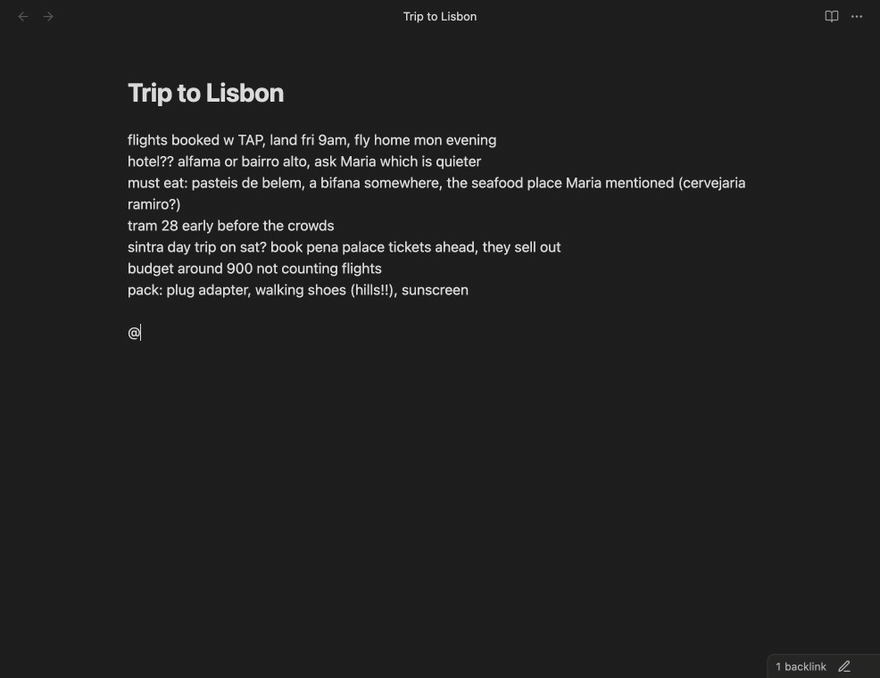
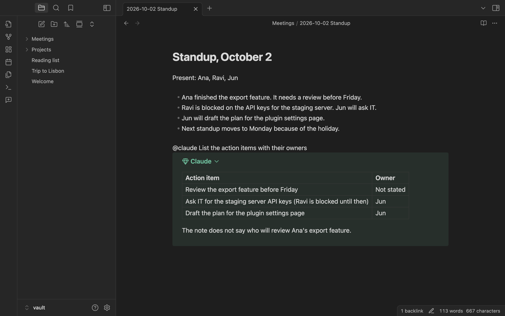
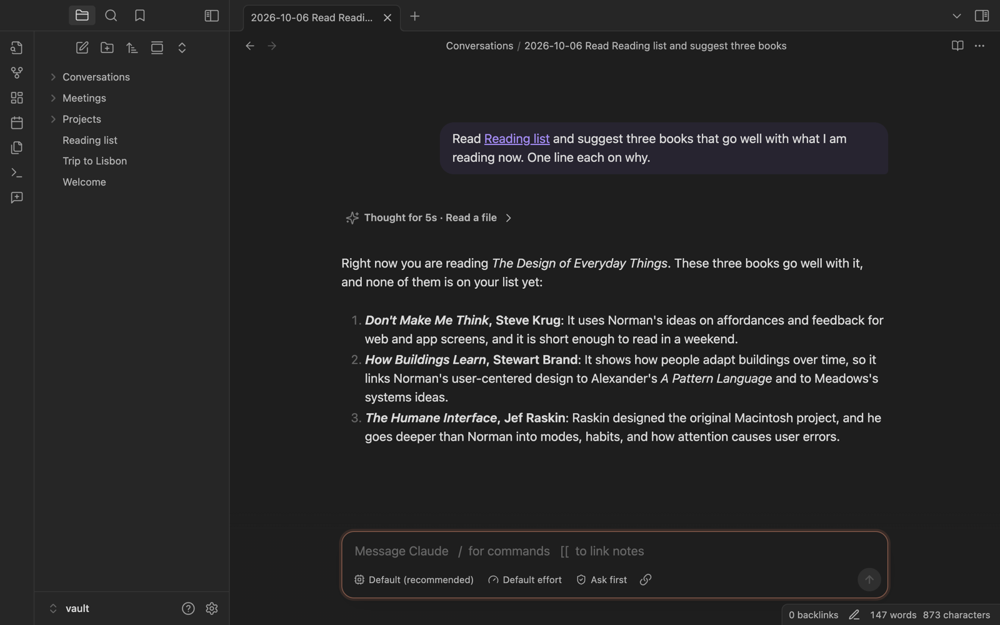
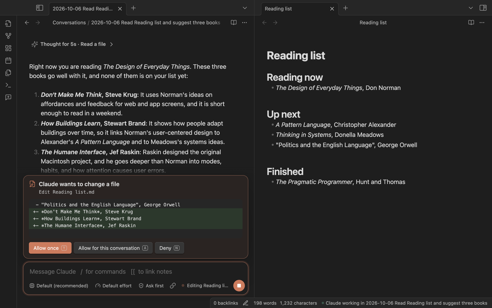
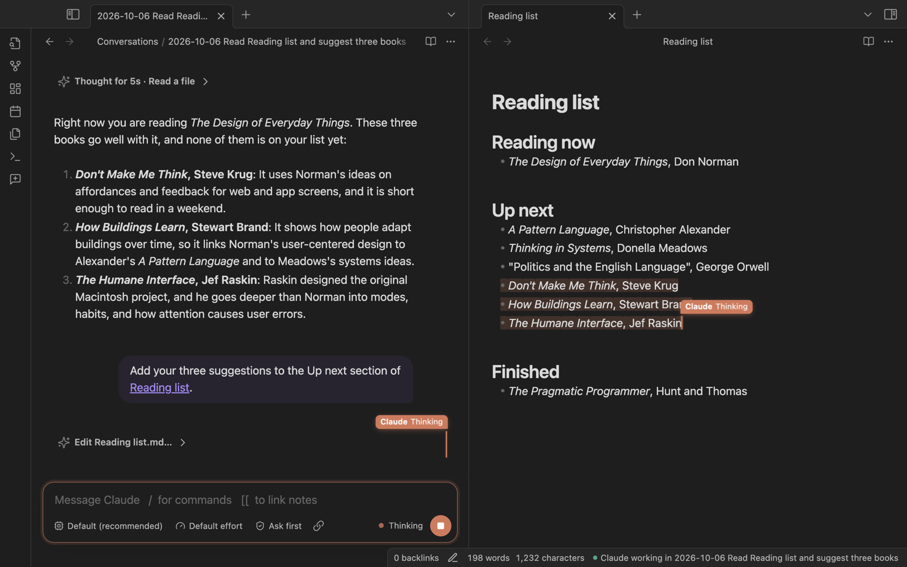

# Duet

Work with Claude Code or Codex inside your Obsidian notes. You and the agent edit the same note at the same time. You see the agent's cursor and each change it makes, and your own typing is never lost.



## About

Coding agents such as Claude Code and Codex are good at more than code. They can read your notes, summarize them, restructure them, and write new ones. But they run in a terminal, and a terminal is a poor place to work with notes.

Duet puts these agents in the editor. Write `@claude` and a request on any line, and the agent answers under that line. It can also edit the note while you keep typing, like a second person in a shared document. For longer work, open a conversation note: the conversation becomes a note in your vault, with every message and tool call recorded.

Duet uses your own Claude Code or Codex installation and login. It does not need an API key of its own.

## Quickstart

### Prerequisites

- Obsidian 1.8.7 or later, on desktop. Duet is tested on macOS.
- Claude Code (`claude`) or the Codex CLI (`codex`), installed and logged in. Check this in a terminal: `claude --version` or `codex --version`.

### Install

1. In Obsidian, open **Settings → Community plugins** and turn off restricted mode.
2. Select **Browse**, search for **Duet**, then select **Install** and **Enable**.

To install by hand, download `main.js`, `manifest.json` and `styles.css` from the [latest release](https://github.com/nathanaday/obsidian-duet/releases/latest). Put them in `<your vault>/.obsidian/plugins/duet/`, then turn on **Duet** under **Settings → Community plugins**.

### Ask your first question

1. Open a note with some text in it.
2. On a new line, write `@claude Summarize this note in one sentence`.
3. Press Enter.

The answer streams into a callout under the line. For Codex, write `@codex` instead.

## Usage

### Mentions

Write `@claude` or `@codex` and a request, then press Enter at the end of the line. The tag can follow other text on the line.



- **Edit the note:** ask for a change, such as `@claude make the list shorter`. The agent changes this note only. It can read your other notes, but it cannot change them or run commands, so a mention never asks for approval.
- **Follow up:** each note keeps its own conversation. A later `@claude make it shorter` in the same note continues it, also after you restart Obsidian.
- **Undo the agent:** run **Duet: Undo the agent's last changes in this note**. This removes the edits of the agent's last turn and keeps your own typing and the agent's reply. Cmd+Z or Ctrl+Z undoes only your own typing.
- **Stop:** run **Duet: Stop the agent in this note**. Assign it a hotkey if you use it often.
- **Start over:** run **Duet: Forget the mention conversation in this note**.

Duet ignores tags in code blocks, in blockquotes and in email addresses.

### Conversation notes

Run **Duet: New conversation**, or select the ribbon button. You get a note with a message box at the bottom. The note records the conversation: your messages, the agent's replies, and its tool calls in collapsed sections. The note gets its name from your first message.



- **Send:** press Enter. Shift+Enter starts a new line. A message that you send while the agent works waits for the current turn to end.
- **Link notes:** type `[[` to pick a note. The agent reads linked notes when it needs them.
- **Commands:** type `/` to see commands. `/model`, `/effort`, `/mode`, `/new` and `/end` belong to Duet. The other commands come from the agent, for example your Claude Code skills.
- **Model, effort and approvals:** use the buttons under the message box. Your choice applies to the next turns and is saved in the note's properties.
- **Stop:** press Escape in the message box, or select the stop button.
- **End:** type `/end`, or run **Duet: End this conversation**. The note stays as a record. Select **Continue it** to reopen the conversation.

In a conversation, the agent can change any file in the vault. Before it changes a file or runs a command, the request shows above the message box with the exact change. Press `Y` to allow it once, `A` to allow it for the rest of the conversation, or `N` to deny it.



When the agent changes a note that is open, you see its cursor in that note. Its changes merge with the text that you type at the same time.



## Settings

Each agent has a tag and its own options. You can add more agents, for example a second Claude account.

| Setting | What it does |
|---|---|
| Tag | The name after `@`. |
| Color | The color of the agent's cursor and highlights. |
| Agent | Claude Code or Codex. |
| Approvals | When the agent asks before it acts, in conversation notes. |
| Model | The model to use. Leave empty for the default. |
| Effort | How much the model reasons. Leave empty for the default. |
| Program path | Leave empty to find the program on your shell's PATH. |
| Environment variables | One `KEY=VALUE` per line. |
| Load my MCP servers and plugins | Claude Code only. Off by default. |

General settings:

| Setting | What it does |
|---|---|
| Conversation folder | Where new conversation notes go. The default is `Conversations`. |
| Show agents typing | Agents type their edits into open notes. Off: edits appear at once. Duet also turns this off when your system asks for reduced motion. |
| Close idle agents after | Minutes without activity before an agent process stops. The next message continues the same conversation. |

To use a second Claude account, add an agent with the tag `work`, the agent Claude Code, and the environment variable `CLAUDE_CONFIG_DIR=~/.claude-work`.

## Network use, accounts and privacy

Duet does not connect to the internet. It starts Claude Code or Codex on your computer, and those programs connect to their providers:

- **Network use:** Claude Code sends your requests, and the note text that it reads, to Anthropic. Codex sends them to OpenAI. This is necessary because the language models run on the providers' servers.
- **Accounts and payment:** Duet is free. Claude Code and Codex each need an account with their provider. Their use can cost money under that account's plan.
- **Files outside the vault:** Duet runs programs that are installed outside the vault: `claude` or `codex`, and your login shell, once after Obsidian starts, to read its PATH. Claude Code and Codex save their conversation history in their own folders, such as `~/.claude` and `~/.codex`. The agents work in the vault folder. Their own permission rules control access to other files, and Duet shows you each approval request that they send.
- **Telemetry:** Duet collects no data. Claude Code and Codex follow the privacy policies of Anthropic and OpenAI.

## Development

```sh
npm install
npm run plugin:dev   # creates dev-vault/ and rebuilds the plugin into it on every change
```

Open `dev-vault/` as a vault in Obsidian. Other commands:

| Command | What it does |
|---|---|
| `npm run plugin:build` | Builds the plugin into `plugin/dist`. |
| `npm run typecheck` | Type-checks the library and the plugin. |
| `npm run lint` | Runs Obsidian's review rules on the plugin code. |
| `npm test` | Runs the unit tests. |
| `npm run test:obsidian` | Starts a separate Obsidian with a temporary vault and tests mentions and conversations with Claude Code and Codex. Your own Obsidian and vaults are not touched. |
| `npm run screenshots` | Captures the images in this README with real agent sessions. |
| `npm run demo` | Starts a browser demo of an agent session at http://localhost:5199. |

To release, run `npm version <x.y.z>` and push the tag with `git push --follow-tags`. The release workflow checks the code, builds the plugin and creates a draft GitHub release. Publish the draft to make the version available.

The plugin is built on a small TypeScript library in `src/` that starts and drives Claude Code and Codex sessions. Its design notes are in [docs/design.md](docs/design.md).

## License

[MIT](LICENSE)
